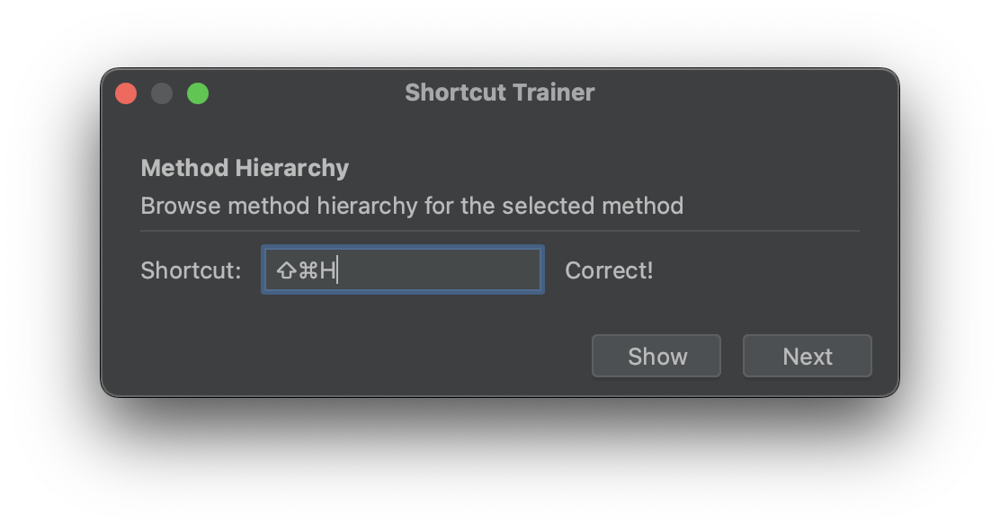

# Shortcut Trainer for IntelliJ IDEA

Improve your efficiency with IntelliJ IDEA by learning and practicing keyboard shortcuts with the Shortcut Trainer plugin.

## Features

- **Random Shortcut Challenge**: Engage with a pop-up that prompts you with a description of a random shortcut from your current keymap.
- **Solution Reveal**: Not sure what the shortcut is? Reveal the solution with a simple keystroke.
- **Continuous Learning**: Move on to the next shortcut challenge to continue learning without interruption.

## Usage

1. **Start Training**: You can start the Shortcut Trainer in two ways:
    - **Keyboard Shortcut**: Press `Cmd-Shift-K` on macOS or `Ctrl-Shift-K` on Windows/Linux to begin training.
    - **Help Menu**: Alternatively, you can start it from the IntelliJ IDEA "Help" menu. Navigate to **Help** > **Shortcut Trainer**.
2. **Reveal Answer**: If you're unsure of the shortcut, you can either press the "Show" button or use the keyboard shortcut `Opt-S` (macOS) or `Alt-S` (Windows/Linux) to reveal the correct answer.
3. **Next Challenge**: Ready for more? You can either click the "Next" button or use the keyboard shortcut `Opt-N` (macOS) or `Alt-N` (Windows/Linux) to advance to the next shortcut.

## Preview

Learn more about the functionality and enjoy the process of mastering your IntelliJ IDEA shortcuts!

## Installation

You can easily install the Shortcut Trainer plugin either from the JetBrains Plugin Marketplace online or directly from within IntelliJ IDEA. Follow these steps based on your preference:

### From JetBrains Plugin Marketplace:

1. Go to the [JetBrains Plugin Marketplace](https://plugins.jetbrains.com).
2. Search for "Shortcut Trainer".
3. Find the plugin in the search results and click on it.
4. Follow the instructions to install it into your IDE.

### From IntelliJ IDEA:

1. Open IntelliJ IDEA and access the **Settings** dialog.
2. Navigate to **Plugins**.
3. Switch to the **Marketplace** tab.
4. In the search bar, type "Shortcut Trainer" and press Enter.
5. Find the plugin in the search results and click **Install**.

After the installation, you may need to restart IntelliJ IDEA to activate the plugin.

## Contributing

Your contributions are welcome! If you'd like to help improve the Shortcut Trainer, please feel free to submit pull requests, report bugs, or suggest new features.

## License

This plugin is open-sourced under the MIT License. See the [LICENSE](LICENSE.md) file for more details.

---

Happy Coding!

Leif Hanack
